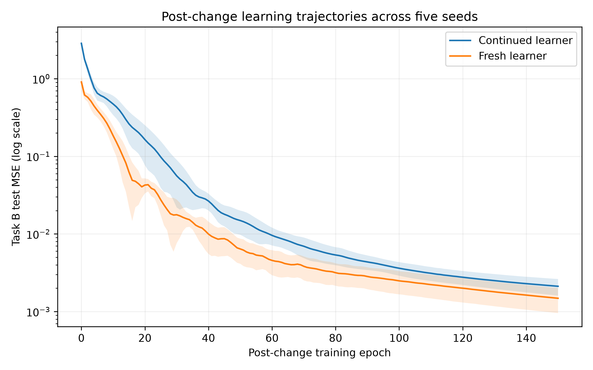

# Study

**Article:** Plasticity Loss in Deep Reinforcement Learning: A Survey

**Authors:** Timo Klein, Christoph Luther, Manus McAuliffe, Lukas Miklautz, Claudia Plant, and Sebastian Tschiatschek

**DOI/URL:** https://doi.org/10.48550/arXiv.2411.04832

**Replication Type:** Proxy Replication

**Computational Environment:** Python 3.13.15 (Windows; CPU)

**Primary Packages:** PyTorch 2.14.0+cpu, NumPy 2.5.3, Pandas 3.0.6, Matplotlib 3.11.2

**Random Seeds:** 11, 22, 33, 44, 55

**Repository:** https://github.com/deepikaavetriselvam/anly735-templates-deepikaavetriselvam/tree/main/replication-lab

# 1. Research Claim

Klein et al. [-@klein2024plasticity] describe plasticity as a neural network's capacity to adapt efficiently as the data it encounters changes. This capacity is especially important in deep reinforcement learning because the agent's own learning continually changes its data distribution. Plasticity loss therefore concerns more than a temporary decrease in performance: a previously trained network can become less effective at learning from subsequent experience. The survey connects this problem to several challenges in deep RL and emphasizes the importance of measuring adaptation rather than relying only on current task performance. In this replication, I focus on that narrower claim: prior training history can alter how effectively a neural network learns after the underlying task changes.

# 2. Replication Strategy

I used a proxy replication rather than attempting to reproduce a full deep reinforcement learning environment. The experiment isolates the learning behavior that is central to the plasticity question. A multilayer neural network was first trained on Task A for 150 epochs. The target function was then changed to Task B while the input distribution, network architecture, optimizer, and training budget were held constant. I compared this continued learner with a newly initialized network trained directly on Task B. Five random seeds were used to reduce dependence on a single initialization. Plasticity was evaluated from the post-change learning trajectory, early rate of error reduction, final Task-B error, and attainment of a predefined performance threshold. Task-A performance before and after adaptation was also measured to examine retention.

# 3. Data

This proxy replication used synthetic regression data generated within the Python experiment rather than data from a reinforcement-learning environment. Each observation contained two continuous input features, independently sampled from a uniform distribution between -2 and 2. I generated 1,200 observations for training and 600 independent observations for testing for each random seed. Task A and Task B used the same input distribution but different nonlinear target functions, allowing the experimental change to occur in the input-output relationship rather than in the predictors themselves. No missing-value treatment, scaling, or other preprocessing was required. The unit of analysis was one synthetic observation, and the outcome was a continuous target value. This simplified dataset differs substantially from the sequential, policy-dependent experience encountered in deep reinforcement learning, but it provides a controlled setting for examining changes in subsequent learning behavior.

# 4. Method

I implemented a feedforward neural network in PyTorch with two input units, two hidden layers of 64 units each with ReLU activation, and one continuous output. The model was optimized with Adam using a learning rate of 0.01 and mean squared error (MSE) as the loss function. For each of five random seeds (11, 22, 33, 44, and 55), a continued model was first trained on Task A for 150 epochs and then trained on Task B for another 150 epochs. A freshly initialized model with the same architecture, optimizer, Task-B data, and training budget served as the comparison condition. Performance was evaluated on an independent test set after every post-change epoch. I measured Task-B MSE, the early log-MSE slope over the first 20 post-change epochs, final error, and whether each model reached a threshold defined as 110% of the fresh learner's final Task-B MSE. Task-A test MSE before and after adaptation was also recorded to quantify retention. All experiments were run on CPU using Python 3.13.15 and PyTorch 2.14.0.

# 5. Results

The continued model remained capable of learning Task B, reducing mean test MSE from 2.85801 immediately after the change to 0.00212 after 150 epochs. However, the fresh learner adapted more rapidly: its mean early log-MSE slope was -0.16801 compared with -0.12560 for the continued learner, where a more negative value indicates faster proportional error reduction. The fresh learner also reached the predefined Task-B performance threshold in all five seeds, whereas the continued learner reached it in only one of five seeds within the training budget. Retention was poor: mean Task-A MSE increased from 0.00057 before the change to 2.85592 after Task-B adaptation. Thus, the change did not merely cause an immediate performance drop; prior training was associated with slower and less reliable subsequent learning.

# 6. Compare

## How closely did your results align with the original study?

| Evidence | Original Study | Replication |
|---|---|---|
| Final-task learning | Plasticity loss is defined through poorer final-task loss relative to a freshly initialized model | Continued: MSE = 0.00212; Fresh: MSE = 0.00148 |
| Subsequent learning behavior | Prior training can reduce the ability to fit new targets | Early log-MSE slope: -0.12560 continued vs. -0.16801 fresh |
| Threshold attainment | Not directly comparable across the surveyed studies | Continued: 1/5 seeds; Fresh: 5/5 seeds |

The replication reproduced the qualitative pattern emphasized by Klein et al. rather than a directly comparable numerical result. After Task A training, the continued network was still able to learn Task B, but its final Task-B error remained higher than that of a freshly initialized network. The learning trajectories added another useful diagnostic: the fresh network showed a faster proportional reduction in error and reached the predefined threshold in every seed, whereas the continued network did so in only one seed. This pattern is consistent with reduced plasticity after prior training. However, the magnitude of the effect cannot be compared directly with the surveyed deep-RL evidence because my experiment used synthetic supervised regression rather than sequential reinforcement learning. The result should therefore be interpreted as evidence that the same learning-capacity pattern can emerge in a simplified controlled setting, not as a numerical reproduction of a particular deep-RL experiment.

# 7. Reproducibility Check

- [x] Data source documented
- [x] Code runs from beginning to end
- [x] Computational environment identified
- [x] Software/packages documented
- [x] Package versions documented when relevant
- [x] Random seed documented when applicable
- [x] Key preprocessing steps documented
- [x] Evaluation procedure documented
- [x] Repository README provides reproduction instructions

**What was the greatest reproducibility challenge you encountered?**

The greatest challenge was translating a broad plasticity-loss construct from deep reinforcement learning into a small, reproducible proxy experiment. The assigned article is a survey that synthesizes multiple definitions, metrics, environments, and mitigation strategies rather than providing one experiment that could simply be rerun. I therefore had to operationalize plasticity explicitly by comparing a previously trained network with a fresh network after a controlled task change. This also required separating an immediate performance drop from a change in subsequent learning capacity. Recording learning trajectories, early learning rates, threshold attainment, and retention made that distinction more reproducible and transparent.

# 8. Extend

## What did the replication reveal that you would investigate next?

A useful extension would be to replace the single Task A-to-Task B transition with a sequence of changing target functions while keeping the architecture and training budget constant. After each transition, I would compare the previously trained network with a freshly initialized network and measure early learning rate, final error, and time to a common performance criterion. This would test whether the learning-rate difference observed in my proxy experiment is a one-time consequence of the first task transition or whether plasticity progressively deteriorates as training history accumulates. I would also evaluate performance on earlier tasks after every transition to track retention alongside new learning. This extension would add knowledge by showing how stability and plasticity evolve over time rather than measuring them at only one point.

# Replication Verdict

- [ ] **Reproduced** — The central result was substantially reproduced.
- [x] **Partially Reproduced** — Some findings were reproduced, but meaningful differences remain.
- [ ] **Not Reproduced** — The central result was not reproduced.
- [ ] **Not Directly Comparable** — A proxy replication produced useful methodological insight, but numerical comparison is not appropriate.

In **2–3 sentences**, defend your verdict.

The proxy experiment partially reproduced the expected plasticity-loss pattern because the previously trained network learned the new task more slowly and reached the performance threshold less consistently than the freshly initialized network. However, the continued learner still successfully reduced its Task-B error, and the experiment used synthetic supervised regression rather than the deep reinforcement-learning settings discussed in the assigned paper. Therefore, the findings support the qualitative pattern but should not be interpreted as a direct numerical reproduction.

# References

::: {#refs}
:::
